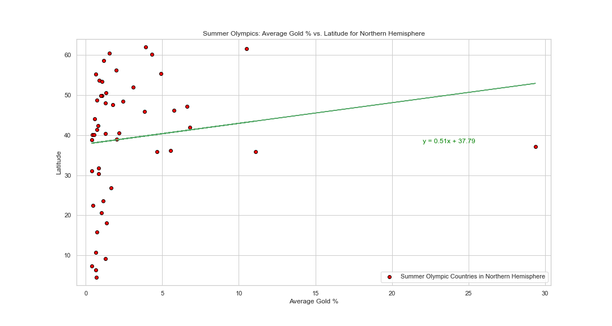

## Final Summary

### Question 1: How do countries who compete only in summer differ from countries that compete in both seasons of Olympics?

### Chart 1: Participation mix by country, regression analysis
#### Northern Hemisphere Olympic Participation
#### Graph: Boxenplot of population by attendance category. Attendance category includes countries that attend both winter and summer olympics (=2), and countries that only attend summer games (=1).
#### Notes: The distribution of population for countries that attend both seasons is skewed, with the high population countries forming the tail. Boxplot display was confusing, with so many outliers. Boxenplot helps to visualize the skew of that distribution.
#### Observations: 
1. Countries that attend summer only have two characteristics:
* They are all close to the equator
* Their population is small, with little variance
2. Countries that participate in both have a wide range of populations, and include both small and the largest countries.  

### Chart 2: Participation mix by country, regression analysis
#### Northern Hemisphere Olympic Participation
#### Graph: Dotplot by latitude and percent of the country's athletes that attend summer olympics; only countries that attend both winter and summer olympics
#### Notes: The metric is the percent of their athletes that attent summer olympics. The purpose of the metric is to show the degree that a country sends more or less of their athletes to the winter or summer olympics.
#### Observations: 
1. For countries below 30 degrees latitude, (i.e. below the southern tip of Florida) participation in the winter olympics drops off considerably
2. In spite of the sharp, non-linear decline in the datapoints < 30 degrees latitude, the linear regression results are significant (p<.05).

### Question 2: Does the country’s latitude impact total number of medals won over time?

### Chart 1: Olympic Performance by Latitude: Summer
#### Northern Hemisphere Countries

#### Observations:
1. With the exception of the outlier, the USA, the majority of medal winning countries are above 30 degrees latitude and have won less than 7% of medals.
2. There is a very weak, positive correlation between latitude and medals won.

### Chart 2: Olympic Performance by Latitude: Winter
#### Northern Hemisphere Countries

#### Observations:
1. Generally, most of the medals are won by countries greater than 35 degrees latitude( North Carolina ~ 35 for reference)
2. There is only one medal winning country below 35 degrees latitude during the winter olympics.
3. The regression analys was not significant, likely due to the low win rate in general, and the low to no win rate for lower latitude countries.

### Main Findings for Question 2
1. A majority of questions that have competed in the olympics have not won a medal.
2. All but one of the winners for medals in the winter olympics are above the 30 degree latitude.
3. The summer correlation is actually for higher latitude countries which is the opposite of what we expected. No sign that countries closer to the equater have an advantage.
4. Overall, not a very strong correlation between total medals won over time and latitude. There are probably other variables at play including number of times countries have participated in the olympics. population size, economic status of country, and investment into the athletes.

### Question 3: Does the country’s latitude impact average gold medal win percentage over time?

### Chart 1: Summer Olympics: Average Gold % vs. Latitude for Northern Hemispshere

#### Observations
1. Majority of countries fall withing the 1-2% regardless of latitude.
2. USA has a much larger average Gold % than the rest of the World, with no other countries breaking 12%.
3. The r value is 0.151 showing  a weak positive correlation when we were really expecting a negative correlation.

### Chart 2: Winter Olympics: Average Gold% vs. Latitude for Northern Hemisphere

#### Observations
1. Relative to Summer, countries are on much higher latitudes, with all byt one above 30 degrees.
2. Relative to Summer, a much more balanced spread, with a majority of countries falling between 5 and 15 %.
3. With an r value of 0.267, the correlation of Average Gold % to Latitude is stronger than summer, but still relatively weak.

### Main Findings for Queston 3

1.No correlation that countries near the equator perform better in the summer olympics. Small correlation towards the opposite.
2. While winter data has a slighlty stronger correlation between Gold % and latitude, the correlation is still fairly week.
3. Overall, the correlation between latitude and gold % isn't strong and there are probably other varaibles at play such as population size, economic status of country, and investment in the atheletes.
