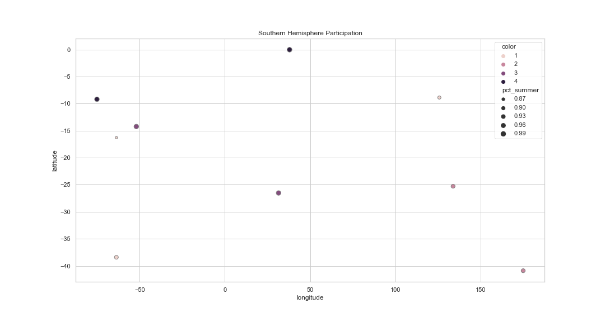

## Graph Explanations

### Participation mix by country
#### Northern Hemisphere Olympic Participation
#### Notes: The metric is the percent of their athletes that attent summer olympics. The purpose of the metric is to show the degree that a country sends more or less of their athletes to the winter or summer olympics.
#### Observations: 
1. With a median percentage of 90%, most countries send the bulk of their athletes to the summer olympics. However, countries in the far northern latitudes send a much more balanced mix of athletes to the olympics, with the percent of their athletes attending summer ranging from 35 to 70%.
2. 

