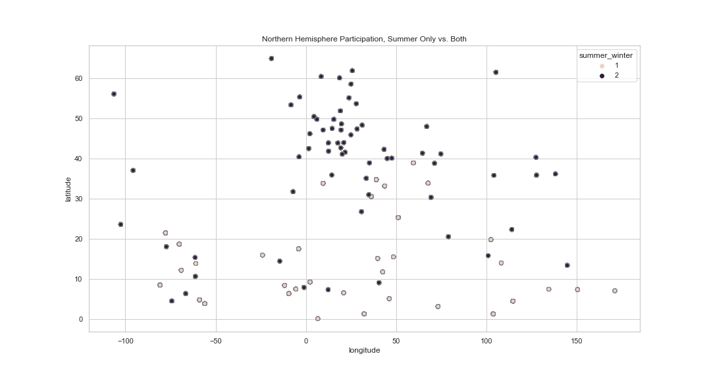

## Graph Explanations

### Graph 1: Participation mix by country, regression analysis
#### Northern Hemisphere Olympic Participation
#### Graph: Scatterplot, Includes countries that attend both winter and summer olympics (=2), and countries that only attend summer games (=1).
#### Notes: Participation is defined as whether a country attends only the summer olympics, or attends summer and winter
#### Observations: 
1. The bulk of the countries that attend only the summer olympics are below 30 degrees latitude (below Florida). Those countries will be excluded from some graphs.
2. There are only a a few countries in higher latitudes that only attend summer, and a few countries in lower latitudes (<30) that attend both.

### Graph 2: Participation mix by country, regression analysis???
#### Northern Hemisphere Olympic Participation
#### Graph: Boxenplot of population by attendance category. Attendance category includes countries that attend both winter and summer olympics (=2), and countries that only attend summer games (=1).
#### Notes: The distribution of population for countries that attend both seasons is skewed, with the high population countries forming the tail. Boxplot display was confusing, with so many outliers. Boxenplot helps to visualize the skew of that distribution.
#### Observations: 
1. Countries that attend summer only have two characteristics:
* They are all close to the equator
* Their population is small, with little variance
2. Countries that participate in both have a wide range of populations, and include both small and the largest countries.  

### Graph 3: Participation mix by country, boxplot
#### Northern Hemisphere Olympic Participation
#### Graph: Boxplot, which includes countries that attend both winter and summer olympics (=2), and countries that only attend summer games (=1).
#### Observations: 
1. The boxplot is a clearer way to show the differences bewteen countries who only attend summer, vs. countries that attend both
2. Without even conducting a statistical test, we can see the median of the "both" group doesn't even overlap the IQR of the "summer only" group
3. Based on the last two graphs, countries that attend only the summer olympics are close to the equator and have the smallest populations.

### Graph 4: Participation mix by country
#### Northern Hemisphere Olympic Participation
#### Graph: Dotplot by longitude and latitude; only countries that attend both winter and summer olympics are included.
#### Observations: 
1. With a median percentage of 90%, most countries send the bulk of their athletes to the summer olympics.
2.  However, countries in the far northern latitudes send a much more balanced mix of athletes to the olympics, with the percent of their athletes attending summer ranging from 35 to 70%.

### Graph 5: Participation mix by country, regression analysis
#### Northern Hemisphere Olympic Participation
#### Graph: Dotplot by latitude and percent of the country's athletes that attend summer olympics; only countries that attend both winter and summer olympics
#### Notes: The metric is the percent of their athletes that attent summer olympics. The purpose of the metric is to show the degree that a country sends more or less of their athletes to the winter or summer olympics.
#### Observations: 
1. For countries below 30 degrees latitude, (i.e. below the southern tip of Florida) participation in the winter olympics drops off considerably
2. In spite of the sharp, non-linear decline in the datapoints < 30 degrees latitude, the linear regression results are significant (p<.05).

